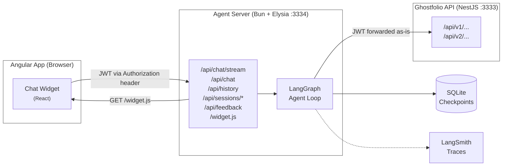
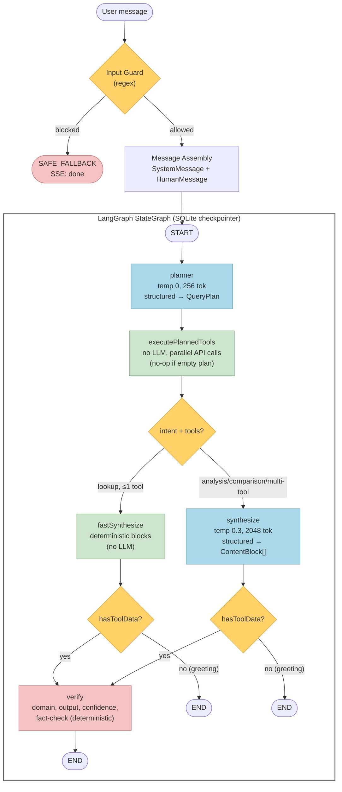
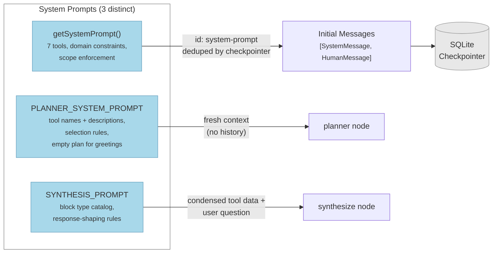
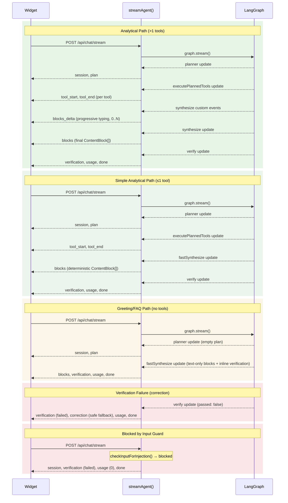
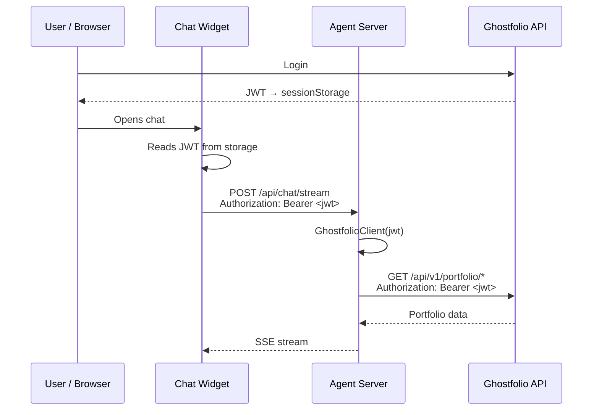

# Agent Architecture

## System Overview



The agent is a **standalone service** that sits between the Angular frontend and the Ghostfolio API. It receives user questions via the chat widget, uses an LLM with bound tools to query Ghostfolio data, and returns verified responses as structured content blocks.

---

## Why Bun

The agent uses [Bun](https://bun.sh) as its runtime instead of Node.js:

- **Native TypeScript execution** — no compilation step needed; `bun run src/main.ts` works directly
- **Built-in bundler** — `Bun.build()` compiles the React widget into a single IIFE bundle (`dist/widget.js`) without Webpack/Vite/esbuild configuration
- **File serving** — `Bun.file()` API for zero-copy static file serving of the widget bundle
- **All-in-one runtime** — test runner (`bun test`), bundler, and HTTP server in a single tool
- **Performance** — faster startup and lower memory footprint than Node.js for a small service

## Why Elysia

The agent uses [Elysia](https://elysiajs.com) instead of NestJS or Express:

- **Built-in validation** — `t.Object()` schema validation on request bodies without class-validator/class-transformer
- **Fluent route API** — routes defined with chained `.get()` / `.post()` calls, minimal boilerplate
- **CORS plugin** — `@elysiajs/cors` provides one-line CORS setup
- **Minimal footprint** — the entire server setup is ~150 lines in a single file
- **Bun-native** — Elysia is built for Bun, leveraging its HTTP server directly

## Why a Standalone Service

The agent runs as a separate process rather than a NestJS module inside the Ghostfolio API:

- **Read-only boundary** — architectural guarantee that the agent never writes to the database; it only calls read-only REST endpoints
- **Independent scaling** — agent load (LLM calls, tool execution) is decoupled from API load
- **Different runtime** — Bun vs Node.js; the main API cannot run Bun-specific code
- **JWT forwarding, not generation** — the agent passes through the user's existing JWT rather than issuing its own credentials, maintaining the API's auth boundary
- **Isolation** — agent crashes, memory leaks, or LLM latency spikes do not affect the main API

## Why LangGraph

The agent uses [LangGraph.js](https://langchain-ai.github.io/langgraphjs/) for orchestration, built on top of LangChain.js:

- **StateGraph** — declarative graph with 5 nodes: `planner` → `executePlannedTools` → [`fastSynthesize` | `synthesize`] → `verify`, with 3 conditional edges for complexity routing and verification skipping
- **`MessagesAnnotation`** — built-in message reducer handles dedup by ID and correct append semantics
- **Tool binding with Zod** — `DynamicStructuredTool` / `.bindTools()` maps Zod schemas directly to OpenAI function-calling format
- **`content_and_artifact` response format** — tools return both text (for the LLM) and structured data (for the widget) in a single response
- **Structured output** — `withStructuredOutput(SynthesisOutputSchema)` produces typed `ContentBlock[]` arrays via OpenAI's structured output mode
- **Checkpointer persistence** — `BaseCheckpointSaver` interface enables pluggable persistence; `BunSqliteSaver` persists conversation state to SQLite across server restarts
- **`traceable` decorator** — wraps the graph invocation for automatic LangSmith trace capture with custom metadata
- **Model flexibility** — swap `ChatOpenAI` model names without changing tool or graph code

---

## Graph Topology



The graph has **5 nodes** and **3 conditional edges**. The planner handles all query types: it returns an empty `toolPlan` for greetings/FAQs/off-topic, and 1-3 tools for analytical queries. After `executePlannedTools`, a conditional edge routes to `fastSynthesize` (single-tool lookups with `intent: "lookup"`, deterministic blocks without LLM) or `synthesize` (analytical/comparison queries or multi-tool plans, LLM-generated blocks). After each synthesis node, a second conditional edge checks whether any tool data was returned — if not (greeting/FAQ path), the graph skips `verify` and goes directly to `END`.

All LLM nodes use the model from `OPENAI_MODEL` env var (default: `gpt-4o`). There is no separate fact-check LLM — all verification is deterministic.

**Legend:** Yellow = decision nodes (no LLM) | Blue = LLM calls | Green = deterministic execution | Red = guardrails

---

## Prompt Flow

### System Prompts

There are 3 distinct system prompts. The diagram below shows how they feed into each node. The verify node uses no LLM — all verification is deterministic.



| Prompt | Used by | Contains tools? |
| --- | --- | --- |
| Main system prompt (`getSystemPrompt()`) | Initial messages, persisted in checkpoint | Yes (all 7) |
| Planner system prompt (`PLANNER_SYSTEM_PROMPT`) | Planner node only | Yes (tool names + descriptions) |
| Synthesis prompt (`SYNTHESIS_PROMPT`) | Synthesize node only | No — receives condensed tool data as context |

### Layer 0: Input Guard (pre-graph)

**File:** `src/server/verification/input-guard.ts`

Before the graph runs, `checkInputForInjection(message)` scans the raw user message with regex patterns for:

- Role reassignment ("you are now a...")
- Instruction overrides ("ignore previous instructions")
- Prompt extraction ("show your system prompt")
- Jailbreak keywords ("DAN", "developer mode")

If blocked, the entire graph is skipped and a `SAFE_FALLBACK_RESPONSE` is returned immediately via SSE.

### Layer 1: Message Assembly (pre-graph)

**File:** `src/server/stream-agent.ts`

Two messages are injected into the graph as `initialMessages`:

```
1. SystemMessage (id: "system-prompt")  <-- from getSystemPrompt()
2. HumanMessage                         <-- raw user input
```

The `SystemMessage` contains:

- Tool descriptions (7 tools)
- Domain constraints (no buy/sell advice, no predictions)
- Scope enforcement (portfolio topics only)
- Identity protection (reject role reassignment)
- Language instructions

The SQLite checkpointer deduplicates the system message by its `id`, so it's only stored once per session. Prior conversation turns are restored from the checkpoint.

### Layer 2: Planner

**File:** `src/server/graph/planner.ts`

The planner is the first node in the graph. It classifies the query intent and selects tools:

```
Messages sent to planner LLM:
  [SystemMessage]    <-- PLANNER_SYSTEM_PROMPT (separate from main system prompt)
  [HumanMessage]     <-- last human message only
```

The planner uses `withStructuredOutput(QueryPlanSchema)` to produce:

```typescript
{
  intent: "analysis" | "lookup" | "comparison" | "general",
  toolPlan: [
    { tool: "portfolio_analysis", reason: "...", parameters: [...] },
    ...
  ],
  reasoning: "..."
}
```

The `toolPlan` array is limited to 0-3 tools (enforced by Zod schema). For greetings, FAQs, off-topic, and buy/sell advice requests, the planner returns `{ intent: "general", toolPlan: [], reasoning: "..." }` — an empty tool plan. The planner prompt instructs the LLM to call the minimum number of tools and avoid adding supplementary tools unless explicitly requested.

The plan is formatted as a `SystemMessage` (id: `query-plan`) and added to state messages. If the planner fails (LLM error), it returns `{}` and the graph continues without a plan (graceful degradation).

### Layer 3: Execute Planned Tools

**File:** `src/server/graph/execute-planned-tools.ts`

Runs tools **directly** from the query plan — no agent LLM in the loop:

1. Reads `state.queryPlan.toolPlan`
2. If the plan is empty (greetings/FAQs), returns `{ toolCalls: [] }` immediately
3. Creates synthetic `AIMessage` with `tool_calls` (required by LangGraph message protocol)
4. Executes all planned tools in parallel via `Promise.all`
5. Returns `ToolMessage` results + `ToolCallRecord` artifacts

Each tool wraps a Ghostfolio REST API call (read-only). Tool artifacts (structured JSON) are stored in `toolCalls` state for both widget rendering and verification.

### Layer 4: Synthesize

**File:** `src/server/graph/synthesize.ts`

The synthesize node replaces both the old template response and micro-synthesis nodes. It uses a single LLM call with structured output to produce `ContentBlock[]`:

```
Messages sent to synthesis LLM:
  [HumanMessage]  <-- single prompt combining:
    - SYNTHESIS_PROMPT (block type catalog + rules)
    - User question
    - Condensed artifact data (from condenseArtifacts())
    - Available tool sources
```

`condenseArtifacts()` converts tool JSON artifacts into a compact ~300-500 token text summary optimized for LLM consumption (e.g. `"AAPL (Apple Inc.): alloc=15.2%, perf=12.3%, class=EQUITY"`).

The LLM returns a `SynthesisOutput` object containing structured `ContentBlock[]` — see [Content Block Schema](#content-block-schema) below. The blocks are stored in `state.contentBlocks` and serialized to plain text via `blocksToText()` for `state.responseText`.

**Greeting/FAQ path:** When no tools were called (empty plan), the synthesize node generates text-only blocks and runs lightweight inline verification (`scoreConfidence()` + `checkForLeaks()`). It returns a `verification` object in state, which causes the graph to skip the downstream verify node via a conditional edge.

**Deterministic fallback:** If the synthesis LLM call fails (e.g. API error), `buildFallbackBlocks()` generates blocks deterministically from tool artifacts — metrics, lists of holdings, and data-reference blocks for charts/tables.

### Layer 5: Verify

**File:** `src/server/graph/nodes.ts`

See [Verification Pipeline](#verification-pipeline) below. The verify node reads `state.contentBlocks` and converts them to plain text via `blocksToText()` for all checks. If tools were called, it unconditionally appends the informational-purposes disclaimer.

---

## Content Block Schema

**File:** `src/server/graph/content-blocks.ts`

Responses are returned as structured `ContentBlock[]` arrays instead of markdown text. Each block is a flat object with a `type` field and all possible fields present (unused fields set to `null`). This flat structure is required because OpenAI's structured output does not support JSON Schema unions (`oneOf`/`anyOf`).

There are two categories of blocks:

### LLM-populated blocks

The LLM writes values directly from tool data:

| Type | Key fields | Description |
| --- | --- | --- |
| `text` | `style`, `value` | Body text. Styles: `title`, `subtitle`, `paragraph`, `caption`, `label` |
| `metric` | `label`, `value`, `format`, `sentiment` | Single metric card (e.g. "Net Worth: $384,161") |
| `metric_row` | `metrics[]` | 2-4 metrics displayed side by side |
| `list` | `items[]` | Bulleted list of strings |
| `symbol` | `symbol`, `name` | Ticker badge (e.g. AAPL — Apple Inc.) |

### Data-reference blocks

The LLM names which tool's data to use; the widget resolves and renders actual data from artifacts:

| Type | Key fields | Description |
| --- | --- | --- |
| `holdings_table` | `source`, `maxRows` | Table of holdings from `portfolio_analysis` or `holdings_search` |
| `pie_chart` | `source` | Donut chart from `portfolio_analysis` |
| `bar_chart` | `source` | Bar chart from `dividend_analysis` or `investment_history` |
| `area_chart` | `source` | Dual-area chart from `performance_report` |
| `rule_status` | `source` | Score badge + rule categories from `risk_assessment` |

### Example responses

**"What is my top position?"** → text + metrics, NO full table:

```json
[
  { "type": "text", "style": "paragraph", "value": "Your top position is Bitcoin..." },
  { "type": "metric", "label": "BTC-USD", "value": "$115,000", "format": "currency" },
  { "type": "metric_row", "metrics": [
    { "label": "Allocation", "value": "29.9%", "format": "percentage", "sentiment": null },
    { "label": "Performance", "value": "+275.75%", "format": "percentage", "sentiment": "positive" }
  ]}
]
```

**"Show my portfolio"** → metrics + chart + table:

```json
[
  { "type": "text", "style": "paragraph", "value": "Here's your portfolio across 14 positions." },
  { "type": "metric_row", "metrics": [
    { "label": "Net Worth", "value": "$384,161" },
    { "label": "Return", "value": "+$159,414", "sentiment": "positive" }
  ]},
  { "type": "pie_chart", "source": "portfolio_analysis" },
  { "type": "holdings_table", "source": "portfolio_analysis" }
]
```

**"Hello"** → text only, no tools:

```json
[
  { "type": "text", "style": "paragraph", "value": "Hello! I'm your Ghostfolio portfolio assistant..." }
]
```

---

## Verification Pipeline

After the synthesize node completes (for analytical responses with tools), the response passes through 5 verification tiers. Only the first two tiers can **block** a response; the remaining three are informational.

The verify node reads `state.contentBlocks` and serializes them to plain text via `blocksToText()` for all checks. It determines whether to append the disclaimer by checking `(state.toolCalls?.length ?? 0) > 0` — if tools were called, it's financial data that needs the disclaimer.

### Tier 1: Domain Constraints (blocking)

Enforces financial compliance rules:

| Rule | Severity | What it catches |
| --- | --- | --- |
| `no-buy-sell-recommendations` | error | "you should buy", "I recommend selling", "go long on" |
| `no-return-predictions` | error | "will return 15%", "price will reach", "guaranteed return" |
| `disclaimer-required` | warning | Portfolio-related responses missing the informational-purposes disclaimer |
| `no-off-topic-content` | error | Off-topic content (recipes, code, travel, etc.) with no financial context |

When the disclaimer is missing, it is **automatically appended** to the response.

### Tier 2: Output Validation (blocking)

Validates response format:

| Rule | Severity | Condition |
| --- | --- | --- |
| `non-empty-response` | error | Empty response |
| `no-stack-traces` | error | Stack traces leaked into response |
| `no-raw-json` | warning | Raw JSON objects in response |
| `no-undefined-null` | warning | Literal "undefined" or "null" in text |
| `reasonable-length` | warning | Response exceeds 5,000 characters |

### Tier 3: Confidence Scoring (informational)

Scores response confidence (0.0-1.0) from observable signals:

- **Data mode** (tools called): weights tool success rate, data citation density, hedging language, and structural formatting
- **Conversational mode** (no tools): weights no-tool appropriateness, absence of fabricated data, hedging, and clarity

Thresholds: `>= 0.7` high, `>= 0.4` medium, `< 0.4` low.

### Tiers 4 & 5: Fact-Check — Deterministic Claim Verification (informational)

**Files:** `src/server/verification/fact-check.ts`, `src/server/verification/fact-check-schema.ts`, `src/server/verification/source-data-index.ts`

Hallucination detection and groundedness scoring use a **fully deterministic 4-phase pipeline**. No LLM is involved — claims are extracted from structured content blocks via parsing and regex, then compared against source data programmatically.

**Phase 1 — Build Source Data Index (deterministic):** `buildSourceDataIndex()` extracts amounts, percentages, counts, and symbols from raw tool call artifacts into typed lookup maps (`SourceDataIndex`).

**Phase 2 — Claim Extraction (deterministic):** `extractClaimsFromBlocks()` walks the structured `ContentBlock[]` array and extracts verifiable claims: `metric` blocks yield amounts/percentages via `parseMetricValue()`, `metric_row` blocks yield multiple metrics, `symbol` blocks yield symbol claims, and `text`/`list` blocks use regex fallback (`extractFallbackClaims()`) to find dollar amounts and percentages. No LLM is involved.

**Phase 3 — Claim Verification (deterministic):** Each extracted claim is compared against the `SourceDataIndex` using Jaccard token-overlap similarity with symbol-aware boosting. Claims receive a verdict: `match`, `mismatch`, `not_in_source`, or `unverifiable`. Tolerances: amounts ≤1% relative, percentages ≤1pp absolute, counts exact, symbols exact set membership.

**Phase 4 — Score Computation (deterministic):** `computeScores()` computes accuracy, precision, and groundedness scores from verdict counts.

**Issue types flagged (from mismatches):**

| Rule | Type | When flagged |
| --- | --- | --- |
| R1 | `percentage_mismatch` | Response percentage differs from source by >1pp |
| R2 | `amount_mismatch` | Response dollar amount differs from source by >1% relative |
| R3 | `symbol_not_in_data` | Financial symbol mentioned but absent from source data |
| R4 | `unsupported_claim` | Assertion not derivable from source data |

All issues are `severity: 'warning'` — they never block the response.

**Groundedness scores** (0.0-1.0):

| Dimension | Weight | What it measures |
| --- | --- | --- |
| Accuracy | 0.40 | Matched numeric claims / checkable numeric claims |
| Precision | 0.35 | Matched symbols / checkable symbols |
| Groundedness | 0.25 | (matched + 0.5 × unverifiable) / all checkable claims |

**Cost:** No LLM cost — all 4 phases are deterministic. Runs after the response is streamed to the user (only delays the `done` SSE event).

**Graceful degradation:** Short-circuits when no tool calls or all calls failed (no ground truth). Returns default pass — never blocks.

> For the full rubric and scoring anchors, see [Eval Results & Verification Rubric](agent-eval-results.md).

---

## SSE Event Sequences



SSE events use `streamMode: ['updates', 'custom']` — `updates` mode emits one chunk per node completion, and `custom` mode emits `blocks_delta` events for progressive typing during LLM synthesis. The `correction` event is emitted when verification fails, replacing previously streamed content with a safe fallback. The widget receives `blocks` events containing `ContentBlock[]` arrays and renders them via `BlockRenderer`.

---

## Auth Flow

The JWT follows a multi-hop path from the Angular app to the Ghostfolio API:



The agent **never generates, modifies, or stores JWTs**. It is a transparent proxy for authentication. If the JWT is invalid or expired, the Ghostfolio API returns 401 and the agent surfaces the error.

---

## LLM Instances

Both `streamAgent()` and `createAndRunAgent()` create 2 LLM instances (planner, synthesis), ensuring consistent behavior between streaming and non-streaming (eval) code paths. Both use `includeRaw: true` for token usage tracking through the pipeline.

The agent uses 2 LLM instances, each optimized for its role. Both use the model from `OPENAI_MODEL` env var (default: `gpt-4o`). Fact-checking is fully deterministic and requires no LLM.

| LLM | Model | Temp | Max Tokens | Structured Output | Purpose |
| --- | --- | --- | --- | --- | --- |
| `plannerLlm` | `$OPENAI_MODEL` | 0.0 | 256 | `QueryPlanSchema` (`includeRaw: true`) | Query classification + tool selection |
| `synthesisLlm` | `$OPENAI_MODEL` | 0.3 | 2048 | `SynthesisOutputSchema` (`includeRaw: true`) | ContentBlock[] generation from tool data |

---

## State Schema

**File:** `src/server/graph/state.ts`

| Field | Type | Reducer | Purpose |
| --- | --- | --- | --- |
| `messages` | `BaseMessage[]` | `messagesStateReducer` | Chat history (dedup by ID) |
| `toolCalls` | `ToolCallRecord[]` | `replace` | Tool results + artifacts (current turn only) |
| `tokenUsage` | `TokenUsage \| null` | `replace` | Accumulated LLM costs |
| `responseText` | `string` | `replace` | Final verified response (`blocksToText()` output) |
| `verification` | `VerificationState \| null` | `replace` | Verification results |
| `iterationCount` | `number` | `replace` | Loop counter |
| `queryPlan` | `QueryPlan \| null` | `replace` | Planner output |
| `contentBlocks` | `ContentBlock[] \| null` | `replace` | Structured response blocks |

---

## Memory Design

Conversation state is persisted via `BunSqliteSaver` — a custom `BaseCheckpointSaver` implementation using Bun's built-in `bun:sqlite`.

| Parameter | Value | Location |
| --- | --- | --- |
| Checkpoint DB path | `./data/checkpoints.db` | `checkpointer.ts` |
| DB path env var | `AGENT_CHECKPOINT_DB` | `checkpointer.ts` |

### Behavior

- **Persistent storage** — conversations survive server restarts via SQLite WAL-mode database
- **Thread-based isolation** — each session ID is a LangGraph thread with its own checkpoint history
- **No TTL / no sliding window** — LangGraph manages state via `messagesStateReducer`; all messages are retained in the checkpoint
- **System prompt dedup** — system prompt is sent with a fixed message ID (`'system-prompt'`), so `messagesStateReducer` deduplicates it across turns
- **Thread deletion** — `deleteThread(threadId)` removes all checkpoints and writes for a session

---

## Widget Architecture

The chat widget is a React application compiled into a single IIFE bundle.

### Build Process

```typescript
// build-widget.ts
await Bun.build({
  entrypoints: ['src/widget/index.tsx'],
  outdir: 'dist',
  naming: 'widget.js',
  target: 'browser',
  format: 'iife',
  minify: true,
  sourcemap: 'none',
  external: [],
  define: { 'process.env.NODE_ENV': '"production"' }
});
```

All dependencies (React, ReactDOM, Recharts) are bundled in — no external CDN loads.

### Block Rendering

The widget renders responses via composable block components:

| Component | Renders | Source |
| --- | --- | --- |
| `BlockRenderer` | Dispatches to per-type views | `blocks/BlockRenderer.tsx` |
| `TextBlockView` | 5 text styles (title, subtitle, paragraph, caption, label) | `blocks/TextBlockView.tsx` |
| `MetricBlockView` | Single metric card with label, value, sentiment color | `blocks/MetricBlockView.tsx` |
| `MetricRowView` | Grid of 2-4 metrics side by side | `blocks/MetricRowView.tsx` |
| `ListBlockView` | Bulleted list | `blocks/ListBlockView.tsx` |
| `SymbolBlockView` | Ticker badge | `blocks/SymbolBlockView.tsx` |
| `HoldingsTableView` | Holdings table (symbol, name, allocation, value, performance) | `blocks/HoldingsTableView.tsx` |
| `PieChartView` | Donut chart (Recharts) | `blocks/PieChartView.tsx` |
| `BarChartView` | Bar chart (Recharts) | `blocks/BarChartView.tsx` |
| `AreaChartView` | Dual-area chart (Recharts) | `blocks/AreaChartView.tsx` |
| `RuleStatusView` | Score badge + category rows | `blocks/RuleStatusView.tsx` |

`BlockRenderer` receives `blocks[]` + `toolCalls[]`. For data-reference blocks, it resolves the `source` field against `toolCalls` to find the matching artifact data.

### Origin Injection

When the agent server serves `GET /widget.js`, it prepends:

```javascript
var __GHOSTFOLIO_AGENT_ORIGIN__ = 'https://agent.example.com:3334';
```

This tells the widget where to send API calls, regardless of which page loads the script.

### Session Persistence & Sidebar

The widget includes a ChatGPT-style sidebar for managing multiple conversations:

- **Session persistence** — session IDs are stored in `localStorage` and restored on page refresh, so conversations survive browser reloads
- **Session list** — tracked client-side in `localStorage` (no backend "list sessions" endpoint needed); each entry stores the session ID, title (first user message, truncated to 60 chars), and timestamps
- **Sidebar** — 260px wide panel on the left side of the chat, showing all past conversations sorted by most recent; includes "New chat" button and per-session delete
- **History loading** — when switching sessions, the widget fetches conversation history from `GET /api/history?sessionId=<id>`; the response includes tool call artifacts extracted from `ToolMessage` objects in the checkpoint, so data visualizations render correctly on reload
- **In-memory cache** — full `Message[]` objects (including `toolCalls`, `runId`, `feedback`) are cached per session in a `Map` ref; switching between sessions within a browser session restores from cache (faster, no network request)
- **Feedback persistence** — LangSmith run IDs and thumbs up/down feedback state are stored per agent message in `localStorage` (`AgentMessageMeta[]`); after page refresh, restored messages show correct feedback state and prevent duplicate submissions
- **Session deletion** — removes the session from localStorage (including run ID metadata) and fires a `DELETE /api/sessions/:id` request to clean up backend checkpoints
- **Mobile** — sidebar is hidden by default on screens < 640px; toggled via a hamburger menu button in the header

### Mount/Unmount Lifecycle

1. Script loads → captures `AUTH_KEY` from `data-auth-key` attribute (default: `'auth-token'`)
2. On DOM ready → calls `refresh()`
3. `refresh()` reads JWT from `sessionStorage` (then `localStorage` fallback)
4. If JWT exists and widget not mounted → creates a `<div id="ghostfolio-agent-widget">`, mounts React root
5. If JWT absent → unmounts widget
6. Listens for `ghostfolio-auth-changed` custom event → re-runs `refresh()` (handles login/logout)

### Integration

```html
<script src="https://agent.example.com:3334/widget.js" data-auth-key="auth-token"></script>
```

The Angular app dispatches `ghostfolio-auth-changed` on login/logout so the widget can mount/unmount reactively.

---

## Key Constants

| Constant | Value | Location |
| --- | --- | --- |
| `OPENAI_MODEL` (default) | `gpt-4o` | `agent.ts` |
| Planner temperature | `0.0` | `stream-agent.ts` |
| Planner maxTokens | `256` | `stream-agent.ts` |
| Synthesis temperature | `0.3` | `stream-agent.ts` |
| Synthesis maxTokens | `2048` | `stream-agent.ts` |
| Max content blocks | `10` | `content-blocks.ts` |
| Checkpoint DB path | `./data/checkpoints.db` | `checkpointer.ts` |
| Checkpoint DB env var | `AGENT_CHECKPOINT_DB` | `checkpointer.ts` |
| Max sidebar sessions | `50` | `session-store.ts` |
| HTTP timeout | `10,000 ms` | `ghostfolio-client.ts` |
| HTTP maxRetries | `1` | `ghostfolio-client.ts` |
| Retry backoff | `1,000 ms` | `ghostfolio-client.ts` |
| Agent server port | `3334` | `main.ts` |
| Widget cache-control | `max-age=3600` | `main.ts` |
| CORS origin | `https://localhost:4200` | `main.ts` |
